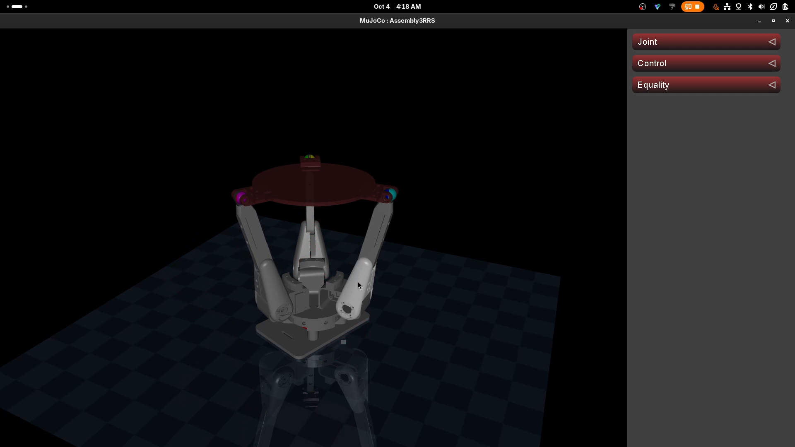

# Ball Balancing Robot(3RRS) MuJoCo Model

A MuJoCo (MJCF/XML) model of a ball-balancing robot built on a **3RRS parallel manipulator** (three legs, each with an actuated revolute joint(**R**), an unactuated revolute joint(**R**) and unactuated spherical joint(**S**)).

## Preview


Video of the model running in MuJoCo (click to play):

[](videos/2026-10-04%2004-18-05.mp4)

CAD model Assembly in Fusion360: [`images/Top_SpherialPtDelta.png`](images/Top_SpherialPtDelta.png)

## Project Structure

```
.
├── scene.xml        # MJCF model 
├── test.py          # Minimal script to load the model and launch the interactive MuJoCo viewer
├── meshes/          # STL meshes 
├── images/          # Screenshots of the model in MuJoCo
└── videos/          # Recording of the simulated model
```

## Running the Simulation

Requires Python with [MuJoCo](https://github.com/google-deepmind/mujoco) installed:

```bash
pip install mujoco
python test.py # This launches the interactive viewer.
```


## Credits & Attribution

- **CAD models** are **not** mine. Original hardware/CAD repository: [KoshiroRobot/Ball-Balancing-Robot](https://github.com/KoshiroRobot/Ball-Balancing-Robot)
- This MuJoCo adaptation was written by **Aditya Shivanand Mhamane**.

## Inspiration

- The lack of simulation models for closed-chain and parallel robots with complex meshes for MuJoCo.
- Issue raised by **Duc-Cuong VU** on the MuJoCo Menagerie repository helped a lot in figuring this stuff out: [google-deepmind/mujoco_menagerie#289](https://github.com/google-deepmind/mujoco_menagerie/issues/289)

## Current Status / Roadmap

Currently learning about:

- Inverse kinematics for closed-chain robots
- Deriving the IK for this specific 3RRS ball-balancing robot
- Simulating a 5R planar parallel robot as a stepping stone
before attempting to fully simulate/control this ball balancer.
